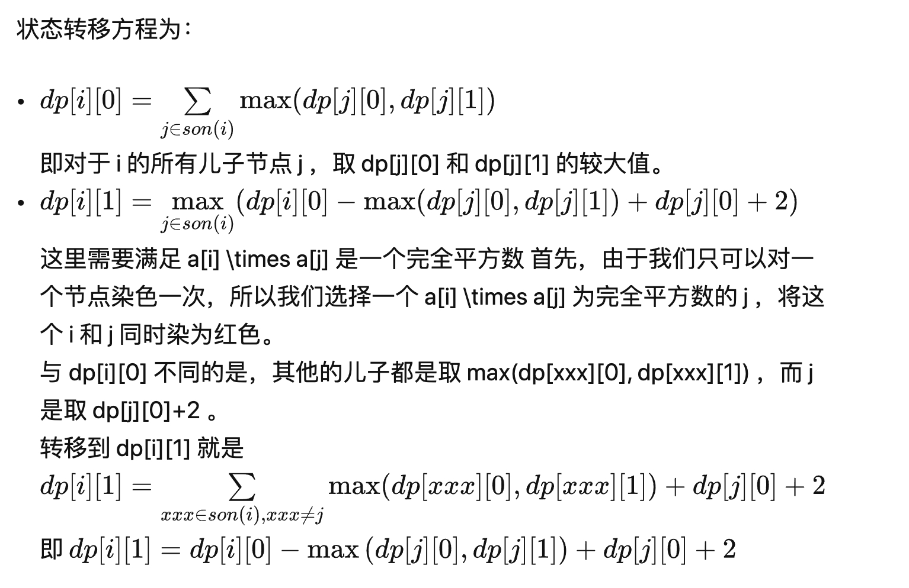

## 美团

### 判断好矩阵

~~~js
const readline = require('readline');

const rl = readline.createInterface({
    input: process.stdin,
    output: process.stdout
});

const arr = []
let cur = -1
let n, m
rl.on('line', function (line) {
  if (cur < 0) {
    [n, m] = line.split(' ').map(Number)
  } else {
    const row = line.split(' ')
    arr.push(row)
  }
  if (arr.length === n) {
    if (n < 3 || m < 3) {
      console.log(0)
      return
    }
    let count = 0
    // 以arr[i][j]为顶点的3x3矩阵
    for (let i = 0; i < n - 3; i++) {
      for (let j = 0; j < n - 3; j++) {
        if (judge(arr, i, j)) {
          conut++
        }
      }
    }
    console.log(count)
  }
  cur++
});

function judge(arr, startX, startY) {
  let A, B, C = 0
  for (let i = startX; i < startX + 3; i++) {
    for (let j = startY; j < startY + 3; j++) {
      if (arr[i][j] !== 'A' && arr[i][j] !== 'B' && arr[i][j] !== 'C') {
        return false
      }
      if (arr[i][j] === 'A') {
        A++
      } else if (arr[i][j] === 'B') {
        B++
      } else if (arr[i][j] === 'C') {
        C++
      }

      if (i <= startX + 1 && j <= startY + 1) {
        if (arr[i][j] === arr[i+1][j] || arr[i][j] === arr[i][j+1]) {
          return false
        } else if (i <= startX + 1 && j === startY + 2) { // 判断最右边
          if (arr[i][j] === arr[i+1][j]) {
            return false
          }
        } else if (i === startX + 2 && j <= startY + 1) { // 判断下边
          if (arr[i][j] === arr[i][j+1]) {
            return false
          }
        }
      }
    }
  }
  if (A === 0 || B === 0 || C === 0) return false
  return true
}
~~~

### 小美的树上染色（树形DP）

小美拿到了一棵树，每个节点有一个权值。初始每个节点都是白色。
小美有若干次操作，每次操作可以选择两个相邻的节点，如果它们都是白色且权值的乘积是完全平方数，小美就可以把这两个节点同时染红。
小美想知道，自己最多可以染红多少个节点？

**输入描述**
第一行输入一个正整数n，代表节点的数量。第二行输入n个正整数ai，代表每个节点的权值。接下来的n-1行，每行输入两个正整数u，v，代表节点u和节点v有一条边连接。

**输出描述**
输出一个整数，表示最多可以染红的节点数量。

示例1
**输入**

~~~js
3
3 3 12
1 2
2 3
~~~

**输出**
`2`

**说明**
可以染红第二个和第三个节点。

请注意，此时不能再染红第一个和第二个节点，因为第二个节点已经被染红。

因此，最多染红 2 个节点。

**思路解法**

树形DP 问题。 考虑DP的状态定义：

+ dp[i][0] 表示以 i 为子树，不选择 i 这个节点进行染色，i 这棵子树可以染色的结点最大数量
+ dp[i][1] 表示以 i 为子树，对 i 这个节点进行染色，i 这棵子树可以染色的结点最大数量

~~~js

~~~

